# Person Card

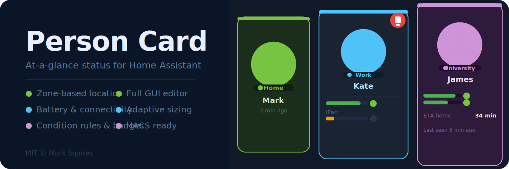

A suite of bold, at-a-glance Lovelace cards for tracking people in Home Assistant — individual detail, household overview, animated grid view, and shared zone theme in one package.

> **Full GUI editor — no YAML required.**

[](https://github.com/hacs/integration)
[](https://www.home-assistant.io)
[](https://github.com/squizzer73/lovelace-person-card/releases/latest)
[](LICENSE)

### Four cards, one package

| Card | Element | Purpose |
|------|---------|---------|
| **Person Card** | `custom:person-card` | Single-person detail card — small, medium, large, hero, and stats layouts |
| **Family Card** | `custom:family-card` | Whole-household overview with compact, mini, and detailed density modes |
| **Family Grid Card** | `custom:family-grid-card` | Animated grid of glowing avatar tiles — readable from across a room |
| **Theme Card** | `custom:person-card-theme` | Set zone colours once; every card on the dashboard inherits them automatically |

---

## Person Card

A single-person status card with five size tiers, zone-coloured styling, per-device battery tracking, condition rules, and more.

### Size Tiers

#### Small · Medium · Large

| Small | Medium | Large |
|-------|--------|-------|
| 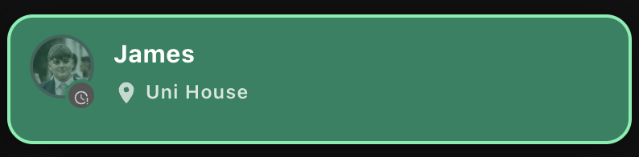 | 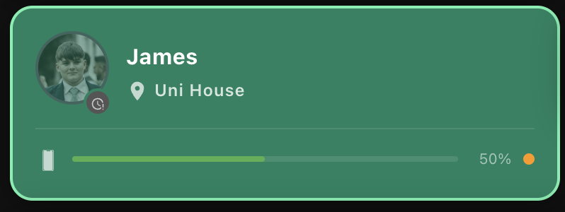 | 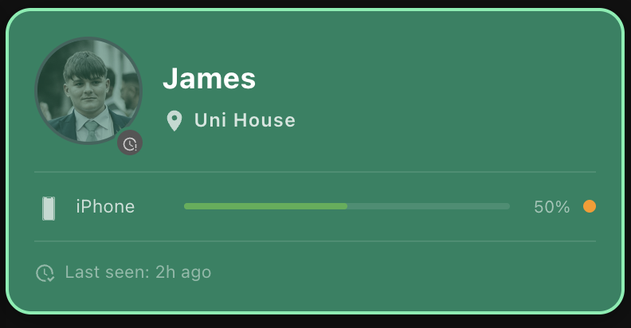 |

- **Small** — Avatar, name, and zone badge only. Ideal in a narrow sidebar column.
- **Medium** — Adds device battery bars and connectivity dots.
- **Large** — Adds last-seen timestamp and ETA travel time sensor.

In `auto` mode (default) the tier updates live via ResizeObserver as the column width changes.

#### Hero

A centred, portrait-style layout designed for a prominent feature card.

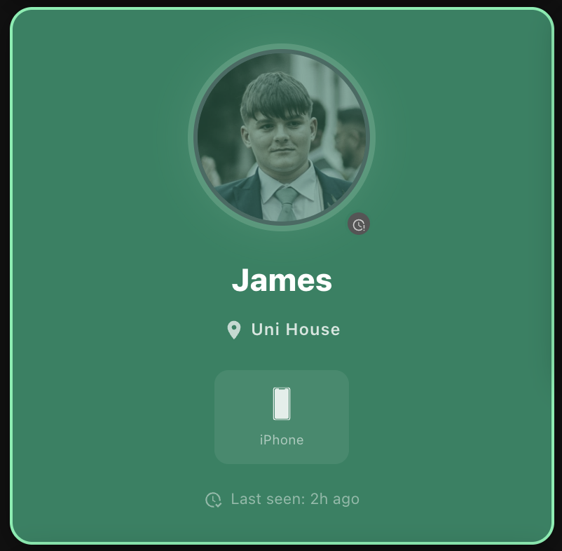

- 120 px avatar with a zone-coloured **glow ring**
- Name in large bold type, zone badge centred below
- Horizontal device icon grid — icon, name, battery bar, and connectivity dot per device
- Last-seen footer and notification badge

#### Stats

An immersive, data-rich layout with a full-bleed background image and presence statistics.

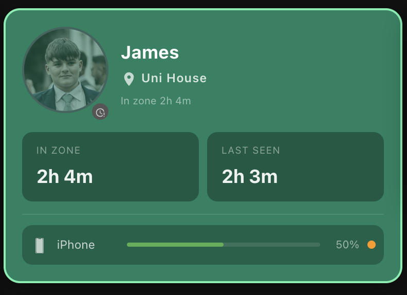

- Background image at 55 % opacity
- "In zone X" sub-label showing how long the person has been in their current zone
- Two stat boxes: *In zone* duration and *Last seen*
- Full device list in a frosted-glass panel

---

### Person Card Features

- **Zone-based styling** — custom background colour, border, icon, and label per zone
- **Zone auto-detect** — one-click button reads all `zone.*` entities from HA and pre-fills the zone list
- **Geocoded address** — shows a live address when outside all zones (scrolling ticker for long strings); falls back to "Away"
- **Per-device status** — battery bar (colour-coded) and connectivity dot for every tracked device
- **Configurable battery threshold** — set a low-battery warning level per device (default 20 %); bar turns red and badge triggers at or below this level
- **Offline / stale indicator** — avatar dims and a clock badge appears when the person entity hasn't updated within a configurable window
- **Condition rule builder** — change card background, border, and notification badge based on any HA entity state (AND/OR; last-match-wins)
- **ETA display** — travel time sensor shown when the person is away (large size)
- **Last seen timestamp** — relative format, auto-refreshes every 60 s
- **Notification badge** — auto-triggers on low battery; fully overridable via condition rules
- **10 built-in colour schemes** — one-click presets plus full custom colour override
- **Background image** — 25 % opacity overlay (55 % on `stats`)
- **Adaptive sizing** — `auto` (ResizeObserver), or pin to `small` / `medium` / `large` / `hero` / `stats`
- **Full GUI editor** — 5 tabs: Person · Devices · Appearance · Conditions · Display

---

### Person Card Configuration

#### Minimal

```yaml
type: custom:person-card
person_entity: person.mark
```

#### Full example

```yaml
type: custom:person-card
person_entity: person.mark
name: Mark                          # optional — overrides entity friendly name
photo: /local/mark.jpg              # optional — overrides entity picture
size: auto                          # auto | small | medium | large | hero | stats
show_eta: true
show_last_seen: true
show_notification_badge: true
address_entity: sensor.marks_phone_geocoded_location
offline_threshold: 30               # minutes; 0 or omit to disable

background_image: /local/backgrounds/city.jpg

zone_styles:
  - zone: home
    label: Home
    icon: mdi:home
    background_color: "#1b2e1b"
    border_color: "#76c442"
  - zone: Work
    label: Office
    icon: mdi:briefcase
    background_color: "#1a2332"
    border_color: "#80deea"
  - zone: not_home
    label: Away
    icon: mdi:map-marker-off

devices:
  - entity: device_tracker.marks_iphone
    name: iPhone
    icon: mdi:cellphone
    battery_entity: sensor.marks_iphone_battery
    connectivity_entity: binary_sensor.marks_iphone_connected
    battery_threshold: 25
  - entity: device_tracker.marks_ipad
    name: iPad
    icon: mdi:tablet
    battery_entity: sensor.marks_ipad_battery
    battery_threshold: 15

conditions:
  - id: low-battery-alert
    label: Low battery alert
    operator: or
    conditions:
      - entity: sensor.marks_iphone_battery
        operator: lte
        value: 20
    effect:
      border_color: "#f44336"
      border_width: 2
      badge_color: "#f44336"
      badge_icon: mdi:battery-alert
```

#### Card options

| Key | Type | Default | Description |
|-----|------|---------|-------------|
| `person_entity` | string | **required** | `person.*` entity ID |
| `name` | string | entity friendly name | Override display name |
| `photo` | string | entity picture | Override avatar URL |
| `size` | `auto` \| `small` \| `medium` \| `large` \| `hero` \| `stats` | `auto` | Card size tier |
| `show_eta` | boolean | `true` | Show ETA footer (large only) |
| `show_last_seen` | boolean | `true` | Show last seen timestamp (large and hero) |
| `show_notification_badge` | boolean | `true` | Enable notification badge |
| `address_entity` | string | — | Sensor with geocoded address string |
| `offline_threshold` | number | — | Minutes without update before avatar is marked stale; `0` or omit to disable |
| `background_image` | string | — | URL for card background image |
| `zone_styles` | list | `[]` | Per-zone colour/icon overrides (see below) |
| `conditions` | list | `[]` | Condition rules for dynamic styling |

#### Device options

| Key | Type | Description |
|-----|------|-------------|
| `entity` | string | `device_tracker.*` entity ID |
| `name` | string | Display name |
| `icon` | string | MDI icon (e.g. `mdi:cellphone`) |
| `battery_entity` | string | `sensor.*` with battery % |
| `connectivity_entity` | string | `binary_sensor.*` — `on` = connected |
| `battery_threshold` | number | Low-battery threshold in % (default `20`) |

#### Zone style options

| Key | Type | Description |
|-----|------|-------------|
| `zone` | string | Matches the person entity state — use the zone's **friendly name** (e.g. `Uni House`, `home`) |
| `label` | string | Override display label |
| `icon` | string | Override MDI icon |
| `background_color` | string | Hex colour for card background |
| `border_color` | string | Hex colour for card border / glow ring |

> **Tip:** Use the **Auto-detect zones from HA** button in the Appearance tab — it reads your `zone.*` entities and pre-fills the list automatically.

#### Condition rule options

| Key | Type | Description |
|-----|------|-------------|
| `operator` | `and` \| `or` | How sub-conditions are combined |
| `conditions` | list | One or more entity conditions |
| `effect` | object | `background_color`, `border_color`, `border_width`, `badge_color`, `badge_icon` |

**Condition:**

| Key | Type | Description |
|-----|------|-------------|
| `entity` | string | Any HA entity ID |
| `attribute` | string | Optional attribute instead of state |
| `operator` | `eq` \| `neq` \| `lt` \| `gt` \| `lte` \| `gte` \| `contains` | Comparison |
| `value` | string \| number | Value to compare against |

> Rules are evaluated top-to-bottom. The **last matching rule wins**.

---

## Family Card

A multi-person overview card for tracking the whole household at a glance. Three density modes, optional zone grouping, and a zone summary bar.

### Density Modes

| Compact | Mini |
|---------|------|
| 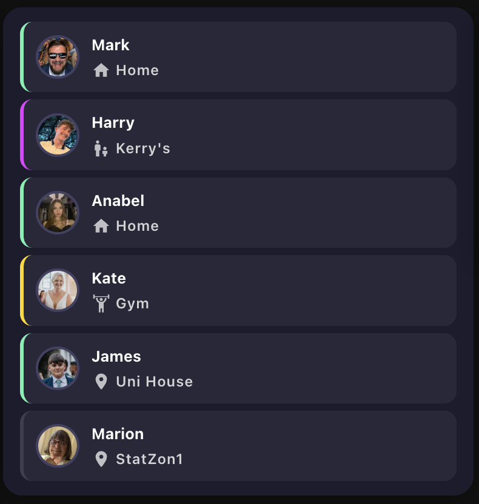 | 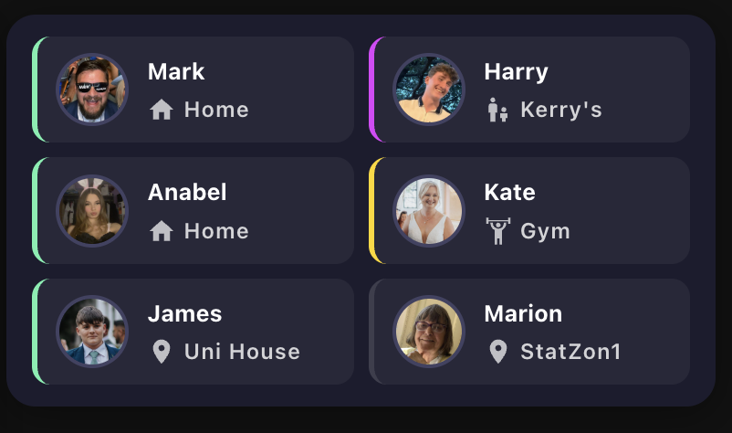 |

- **Compact** — one row per person: avatar, name, zone badge, and status dot
- **Mini** — tile grid per person with battery percentage and connectivity
- **Detailed** — expandable rows; tap any row to reveal the full device list, last seen, ETA, and a "View full card →" link

### Group by Zone

Enable `group_by_zone` to cluster people under coloured zone group headers — great for seeing who is where at a glance.

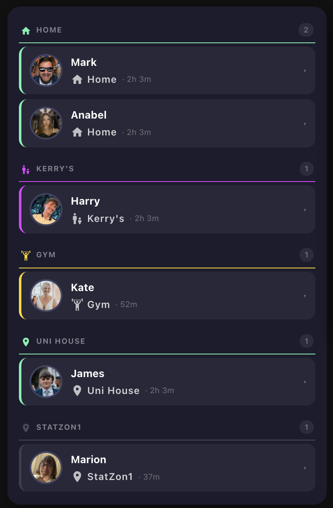

A **zone summary bar** (`show_summary`) displays a coloured dot, count, and label for every occupied zone at the top of the card.

Both features can be toggled independently in the **Display** tab of the editor.

---

### Family Card Features

- **Three density tiers** — Compact, Mini, Detailed
- **Group by zone** — clusters people under coloured zone headers; Home appears first, then other zones by occupancy
- **Zone summary bar** — compact coloured-dot overview above the people list
- **Inline expand** (detailed) — tap any row for the full device list, last seen, ETA, and "View full card" link
- **Group entity support** — point at a `group.*` entity and people are auto-discovered
- **Per-person overrides** — display name, photo, ETA sensor per person
- **Shared zone colours** — automatically inherits from the Theme Card; per-card `zone_styles` override if needed
- **Full GUI editor** — 4 tabs: People · Appearance · Conditions · Display

---

### Family Card Configuration

```yaml
type: custom:family-card
density: detailed                   # compact | mini | detailed
show_devices: true
show_last_seen: true
show_eta: true
show_notification_badge: true
group_by_zone: false                # cluster people under zone headers
show_summary: false                 # zone summary bar at the top
offline_threshold: 30               # minutes; 0 or omit to disable

people:
  - entity: person.mark
    eta_entity: sensor.marks_travel_time
  - entity: person.harry
  - entity: person.anabel
  - entity: person.kate
  - entity: person.james
  - entity: person.marion
```

Alternatively, point at a HA group entity and people are auto-discovered:

```yaml
type: custom:family-card
group_entity: group.family
density: detailed
```

#### Family card options

| Key | Type | Default | Description |
|-----|------|---------|-------------|
| `density` | `compact` \| `mini` \| `detailed` | `detailed` | Display density |
| `group_by_zone` | boolean | `false` | Cluster people under zone group headers |
| `show_summary` | boolean | `false` | Show zone summary bar at the top |
| `show_devices` | boolean | `true` | Show device battery/connectivity info |
| `show_last_seen` | boolean | `true` | Show last seen timestamp |
| `show_eta` | boolean | `true` | Show ETA from travel time sensor |
| `show_notification_badge` | boolean | `true` | Enable notification badges |
| `offline_threshold` | number | — | Minutes before avatar is marked stale |
| `people` | list | — | List of person entities (see below) |
| `group_entity` | string | — | `group.*` entity — people auto-discovered |
| `zone_styles` | list | `[]` | Per-zone overrides (falls back to Theme Card) |

#### Per-person options (`people` list)

| Key | Type | Description |
|-----|------|-------------|
| `entity` | string | `person.*` entity ID |
| `name` | string | Override display name |
| `photo` | string | Override avatar URL |
| `eta_entity` | string | Travel time sensor for this person |

---

## Family Grid Card

A bold presence-at-a-glance card: every family member rendered as a large glowing animated tile in a configurable grid. Designed to be readable from across a room.

Each tile has a **breathing coloured ring** whose colour comes from your zone styles. People at home pulse slowly (calm); everyone else pulses faster (draws the eye to who's out). A colour-matched zone badge pill below the name tells you where they are.

### Family Grid Card Features

- **Animated ring tiles** — breathing glow ring (`box-shadow` pulse) plus an outward ripple on every avatar
- **Ring colour from zone styles** — same zone style system as Family Card and Theme Card; falls back to a subtle white ring if no style is set
- **Home vs. away speed** — home = 3 s breathe cycle; all other zones = 1.8 s (subtly faster to draw attention)
- **Configurable columns** — 1–6 columns; tiles and ring sizes scale automatically
- **Optional header** — set `title` to show a card header with a live "X home · Y away" summary
- **Avatar or initials** — uses `entity_picture` from the person entity; falls back to the person's initial if no photo is set
- **Shared zone colours** — inherits from the Theme Card; per-card `zone_styles` override if needed
- **Full GUI editor** — Display · People · Zone Styles tabs

### Family Grid Card Configuration

```yaml
type: custom:family-grid-card
title: Family               # optional — shows header with home/away summary
columns: 3                  # 1–6, default 3
people:
  - entity: person.mark
  - entity: person.sarah
    name: Sarah             # optional name override
  - entity: person.james
  - entity: person.lucy
zone_styles:
  - zone: home
    label: Home
    icon: mdi:home
    border_color: "#76c442"
  - zone: not_home
    label: Away
    icon: mdi:map-marker-off
    border_color: "#ff6d00"
```

#### Family grid card options

| Key | Type | Default | Description |
|-----|------|---------|-------------|
| `title` | string | — | Card header label. If omitted, no header is shown |
| `columns` | number | `3` | Grid column count (1–6) |
| `people` | list | — | List of person entities to display |
| `zone_styles` | list | `[]` | Per-zone colour/icon overrides (falls back to Theme Card) |

#### Per-person options (`people` list)

| Key | Type | Description |
|-----|------|-------------|
| `entity` | string | `person.*` entity ID |
| `name` | string | Override display name |

> **Installation note:** `family-grid-card` is a separate JS file — add `dist/family-grid-card.js` as a second Lovelace resource alongside `person-card.js`. See [Installation](#installation) below.

---

## Theme Card

Configure zone colours once and every Person Card and Family Card on the dashboard inherits them automatically.

### Display Styles

Six visual styles to suit different dashboard layouts — selectable from a visual picker in the editor.

| Legend | Compact | List | Grid |
|--------|---------|------|------|
| 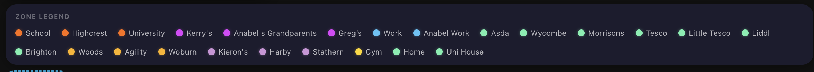 | 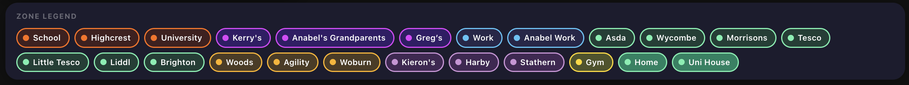 | 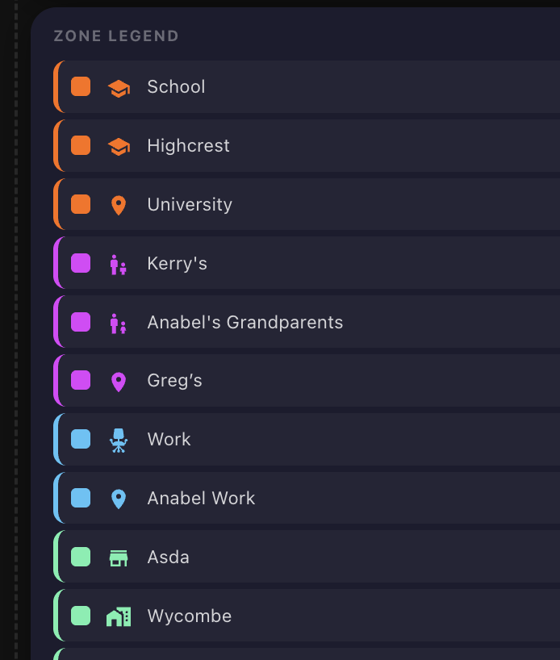 | 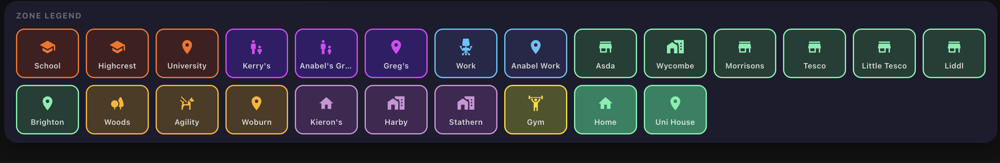 |

- **`legend`** *(default)* — coloured dots with labels in a wrapping row
- **`compact`** — smaller dots and tighter spacing for crowded dashboards
- **`pills`** — filled pill/badge tags using each zone's background and border colour
- **`list`** — vertical list with colour swatch, zone icon, and label; best for many zones
- **`grid`** — zone icon tiles in a responsive auto-fill grid with colour accents
- **`hidden`** — card takes no space; purely provides the shared zone theme to other cards on the dashboard

---

### Theme Card Configuration

```yaml
type: custom:person-card-theme
display_style: legend               # legend | compact | pills | list | grid | hidden
zone_styles:
  - zone: home
    label: Home
    icon: mdi:home
    background_color: "#1b2e1b"
    border_color: "#76c442"
  - zone: Uni House
    label: Uni House
    icon: mdi:school
    background_color: "#1a2332"
    border_color: "#80deea"
  - zone: Kerry's
    label: Kerry's
    icon: mdi:account-group
    background_color: "#2e1b3c"
    border_color: "#ce93d8"
  - zone: not_home
    label: Away
    icon: mdi:map-marker-off
    border_color: "#ff6d00"
```

Place the Theme Card anywhere on the dashboard — all Person Cards and Family Cards on the same page pick it up automatically. Per-card `zone_styles` overrides the theme if set.

#### Theme card options

| Key | Type | Default | Description |
|-----|------|---------|-------------|
| `display_style` | `legend` \| `compact` \| `pills` \| `list` \| `grid` \| `hidden` | `legend` | Visual rendering mode |
| `zone_styles` | list | **required** | Zone colour/icon definitions (same format as Person Card) |

---

## GUI Editor — No YAML Required

All four cards have a full visual editor. The card picker preview populates with real entities from your HA instance so you can see exactly what the card will look like before adding it.

### Person Card Editor

| Person | Devices | Appearance |
|--------|---------|------------|
| 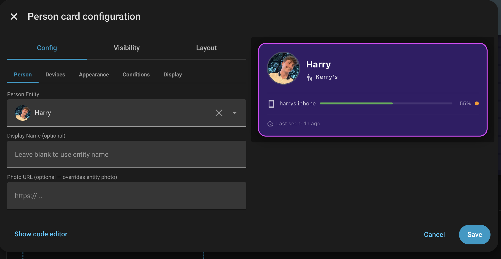 | 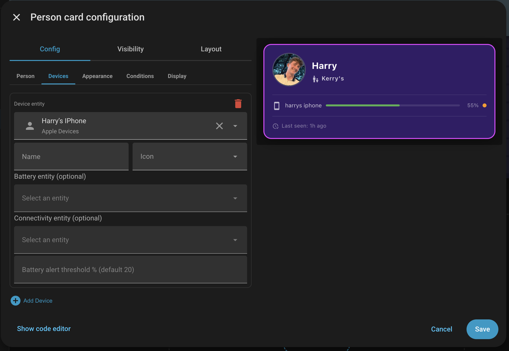 | 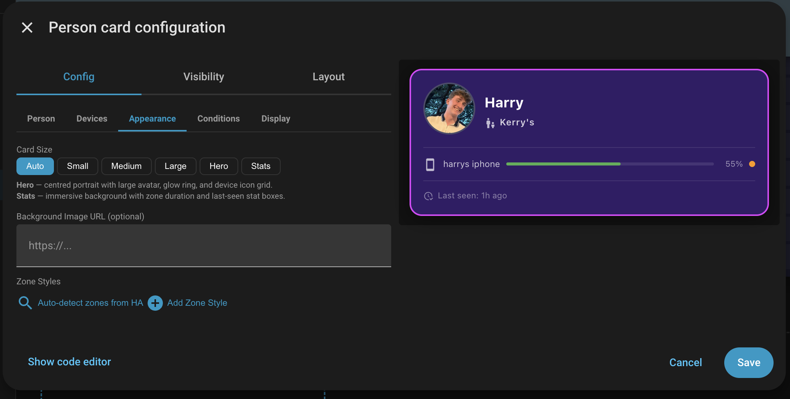 |

| Conditions | Display |
|------------|---------|
| 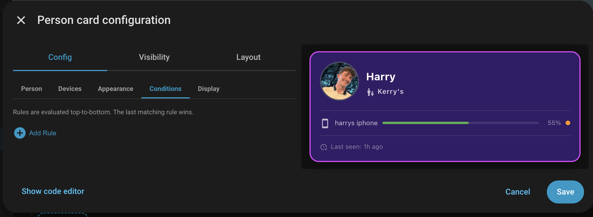 | 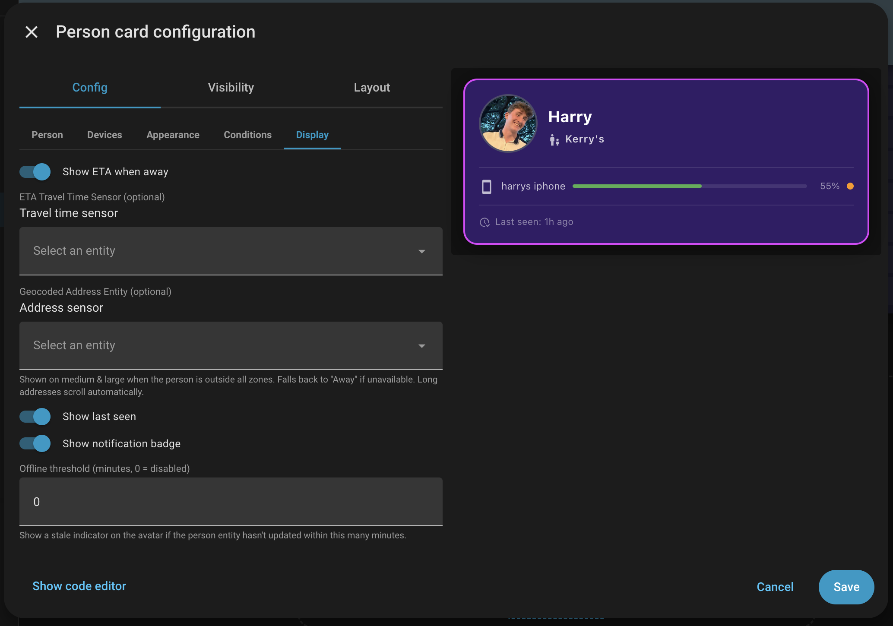 |

- **Person** — entity picker, display name, photo URL override
- **Devices** — add/remove devices; set name, icon, battery/connectivity entities, and threshold per device
- **Appearance** — size picker (with inline descriptions for Hero and Stats), background image, zone styles with auto-detect and colour scheme swatches
- **Conditions** — AND/OR rule builder for dynamic styling
- **Display** — show/hide ETA, last seen, notification badge; geocoded address entity; offline threshold

### Family Card Editor

| People | Appearance | Display |
|--------|------------|---------|
| 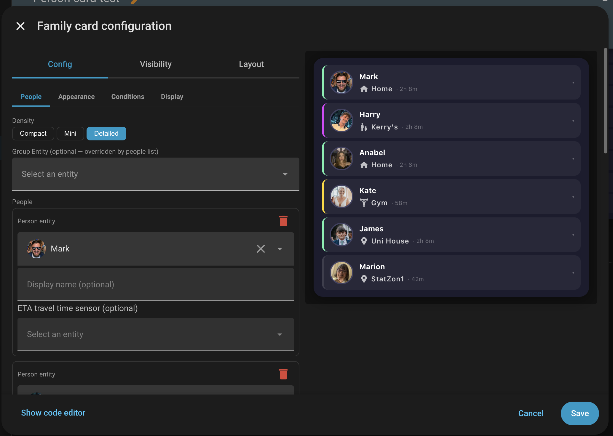 | 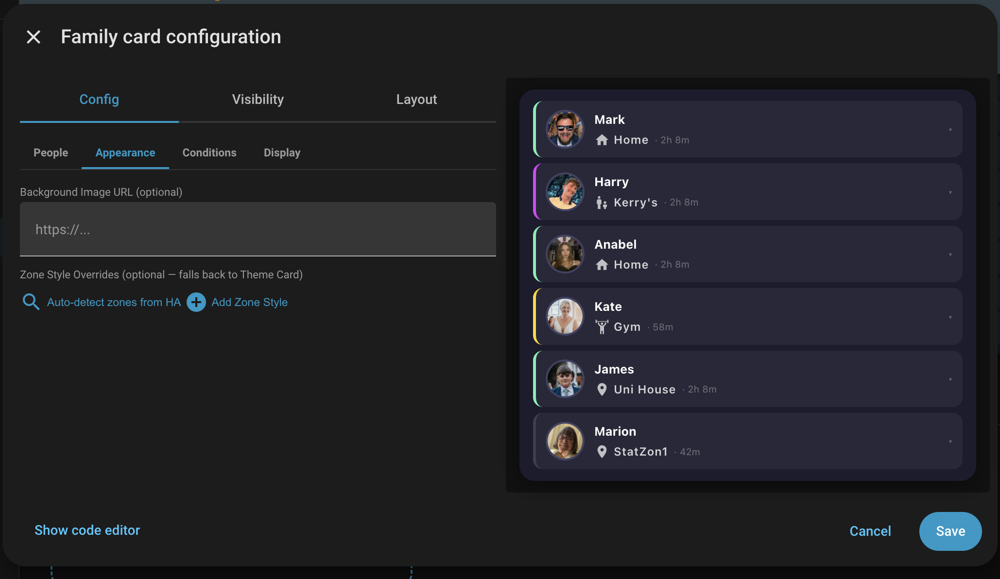 | 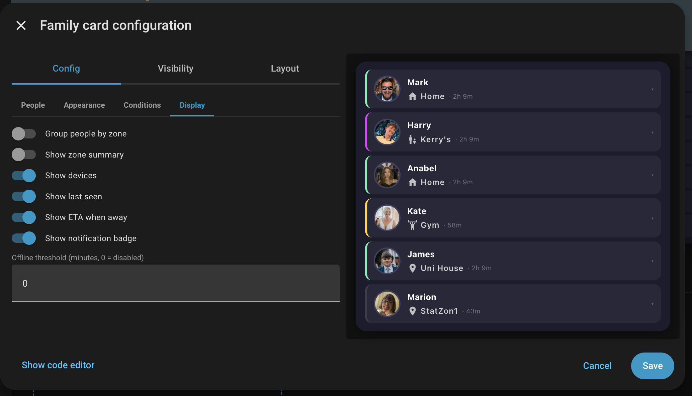 |

- **People** — density selector (Compact / Mini / Detailed), group entity, and per-person entries with name, photo, and ETA sensor
- **Appearance** — background image and zone style overrides (with auto-detect from HA)
- **Conditions** — AND/OR rule builder
- **Display** — group by zone, zone summary bar, show/hide devices, last seen, ETA, notification badge, offline threshold

### Family Grid Card Editor

Three tabs:

- **Display** — card title and column count (1–6)
- **People** — entity picker per person, optional name override; add/remove entries
- **Zone Styles** — same zone colour/icon editor as Family Card; or leave empty to inherit from the Theme Card

### Theme Card Editor

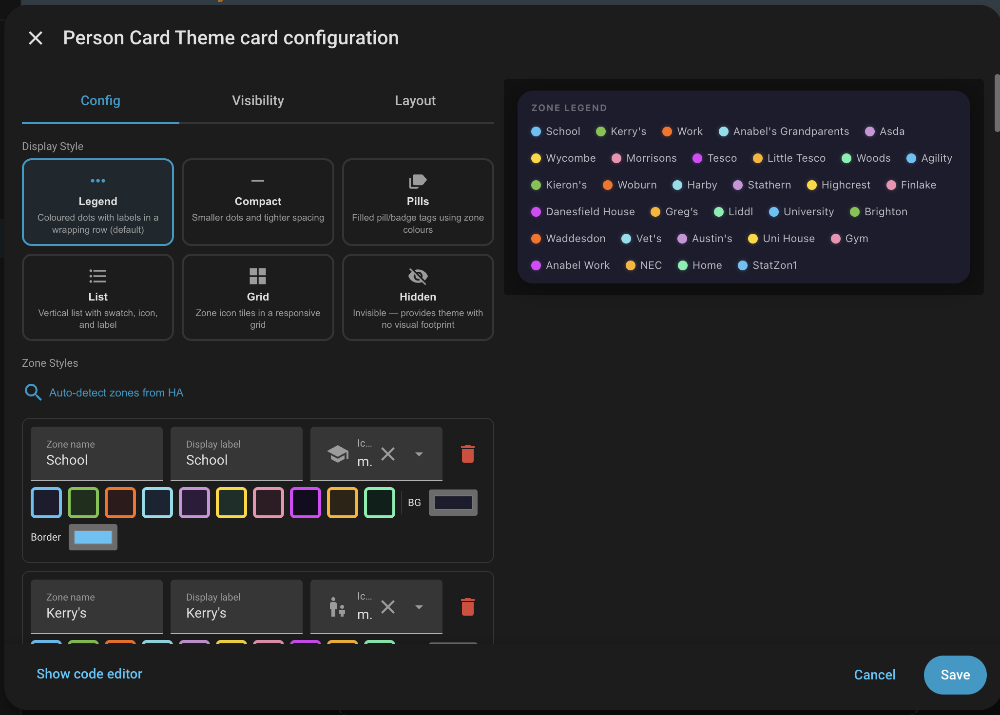

- Visual 3×2 display style picker with inline descriptions
- Zone list with auto-detect from HA, plus full colour picker and icon selector per zone

---

## Installation

### HACS (recommended)

[](https://my.home-assistant.io/redirect/hacs_repository/?owner=squizzer73&repository=lovelace-person-card&category=plugin)

Or add manually:

1. In HA → **HACS** → ⋮ → **Custom repositories**
2. Repository: `squizzer73/lovelace-person-card` · Category: **Dashboard**
3. Click **Add** → find **Person Card** → **Download**
4. Refresh the browser, then add the card to any dashboard

### Manual

1. Download `person-card.js` (and `family-grid-card.js` if you want the grid card) from the [latest release](https://github.com/squizzer73/lovelace-person-card/releases/latest)
2. Copy to `/config/www/`
3. **Settings → Dashboards → Resources** → add each file as a JavaScript module:
   - `/local/person-card.js`
   - `/local/family-grid-card.js` *(only needed for `custom:family-grid-card`)*
4. Refresh the browser

> `custom:person-card`, `custom:family-card`, and `custom:person-card-theme` are all registered from `person-card.js`. The `custom:family-grid-card` is a separate file — add it as a second resource only if you use the grid card.

---

## Colour Schemes

The editor includes 10 built-in colour scheme presets. Click any swatch in the Appearance tab to apply it to a zone style, then fine-tune with the colour pickers.

| Name | Background | Border |
|------|-----------|--------|
| Midnight | `#1c1c2e` | `#4fc3f7` |
| Forest Walk | `#1b2e1b` | `#76c442` |
| Lava Flow | `#2e1b1b` | `#ff6d00` |
| Arctic Drift | `#1a2332` | `#80deea` |
| Twilight | `#2e1b3c` | `#ce93d8` |
| Emerald City | `#1b2e28` | `#ffd700` |
| Rose Gold | `#2e1c24` | `#f48fb1` |
| Neon Tokyo | `#120d1f` | `#e040fb` |
| Desert Night | `#2e2416` | `#ffb300` |
| Northern Lights | `#0d1f1a` | `#69f0ae` |

---

## Geocoded Address

When a person is outside all defined zones, the card can display a live geocoded address instead of "Away":

1. Set up a sensor that provides the address string — common sources:
   - **HA Companion App** (iOS/Android) — the `sensor.<device>_geocoded_location` entity
   - A **template sensor** combining reverse geocode data
   - **OwnTracks**, **Life360**, or similar integrations
2. In the card editor → **Display** tab → set **Geocoded Address Entity**
3. On `medium` and `large` sizes the address replaces "Away" when the person is `not_home`
   - Short addresses — truncates with ellipsis if needed
   - Long addresses — smooth CSS ticker animation, loops seamlessly
4. Falls back to "Away" if the entity is `unavailable` or `unknown`

---

## Offline / Stale Indicator

When a person's location hasn't updated for a while, the card can visually flag this:

1. In the card editor → **Display** tab → set **Offline threshold (minutes)**
2. If the person entity's `last_updated` is older than the threshold:
   - Avatar dims to 55 % opacity with a greyscale filter
   - A small **clock badge** appears at the bottom-right of the avatar
3. Set to `0` or leave blank to disable

This is distinct from the per-device connectivity dot — the stale indicator reflects the person entity itself not reporting in.

---

## Zone Auto-Detect

Rather than typing zone names manually, the editor can read them directly from Home Assistant:

1. In the card editor → **Appearance** tab → click **Auto-detect zones from HA**
2. All `zone.*` entities are read and any zones not already configured are added with their friendly name, icon, and a colour scheme preset
3. Adjust the label, colours, and icon for each zone as needed

> Zone names must match the **friendly name** that Home Assistant returns as the person's state (e.g. `Uni House`, not `uni_house`). Auto-detect handles this automatically; the zone editor shows the friendly name by default.

---

## CSS Custom Properties

Override card appearance from your Lovelace theme or card-mod:

| Property | Default | Description |
|----------|---------|-------------|
| `--person-card-font-family` | `Segoe UI, system-ui, sans-serif` | Card font |
| `--person-card-border-radius` | `16px` | Card corner radius |
| `--person-card-avatar-size` | `48px` | Avatar size (medium) |

---

## Development

```bash
git clone https://github.com/squizzer73/lovelace-person-card.git
cd lovelace-person-card
npm install
npm run build      # outputs dist/person-card.js (all three cards bundled)
npm test           # vitest unit tests
npm run typecheck  # TypeScript type checking
```

**Stack:** Lit 3 · TypeScript · esbuild · vitest

---

## Contributing

Issues and PRs are welcome. Please open an issue first for significant changes.

---

## Licence

MIT © Mark Squires
