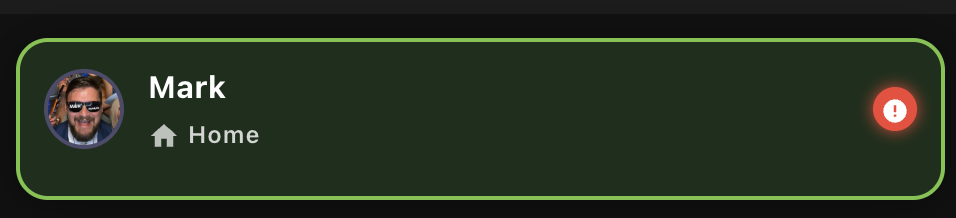
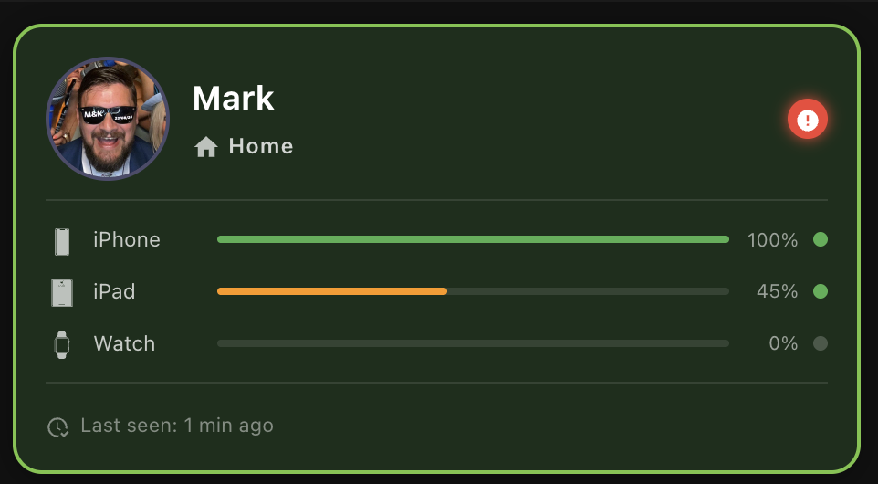

# Person Card

A bold, opinionated at-a-glance status card for a person in Home Assistant.

> **Full GUI editor — no YAML required.**


---

## Screenshots

### Card sizes

| Small | Medium | Large |
|-------|--------|-------|
|  |  |  |

### Editor


---

## Features

- **Zone-based location** — hero display with custom icon, label, and colour per zone
- **Geocoded address** — shows live address when outside all zones (scrolling ticker for long addresses), falls back to "Away"
- **Per-device status** — battery bar (colour-coded) and connectivity dot for each tracked device
- **Condition rule builder** — change card background, border, and notification badge based on any HA entity state
- **10 built-in colour schemes** — one-click presets plus full custom colour override
- **ETA display** — shows travel time sensor when the person is away (large size)
- **Last seen timestamp** — relative or absolute, auto-refreshes every 60 s
- **Notification badge** — auto-triggers on low battery (≤20 %) or via condition rules
- **Adaptive sizing** — `auto` uses ResizeObserver; or pin to `small` / `medium` / `large`
- **Tabbed GUI editor** — Person · Devices · Appearance · Conditions · Display

---

## Installation

### HACS (recommended)

1. In HA → **HACS** → ⋮ → **Custom repositories**
2. Repository: `squizzer73/lovelace-person-card` · Category: **Dashboard**
3. Click **Add** → find **Person Card** → **Download**
4. Refresh the browser, then add the card to any dashboard

### Manual

1. Download `person-card.js` from the [latest release](https://github.com/squizzer73/lovelace-person-card/releases/latest)
2. Copy to `/config/www/person-card.js`
3. **Settings → Dashboards → Resources** → add `/local/person-card.js` (type: JavaScript module)
4. Refresh the browser

---

## Configuration

The card has a full GUI editor. Everything below is the equivalent YAML for reference.

### Minimal

```yaml
type: custom:person-card
person_entity: person.mark
```

### Full example

```yaml
type: custom:person-card
person_entity: person.mark
name: Mark                          # optional — overrides entity friendly name
photo: /local/mark.jpg              # optional — overrides entity picture
size: auto                          # auto | small | medium | large
show_eta: true
show_last_seen: true
show_notification_badge: true
address_entity: sensor.marks_phone_geocoded_location  # optional

background_image: /local/backgrounds/city.jpg   # optional

zone_styles:
  - zone: home
    label: Home
    icon: mdi:home
    background_color: "#1b2e1b"
    border_color: "#76c442"
  - zone: work
    label: Office
    icon: mdi:briefcase
    background_color: "#1a2332"
    border_color: "#80deea"
  - zone: not_home
    label: Away
    icon: mdi:map-marker-off

devices:
  - entity: device_tracker.marks_phone
    name: Phone
    icon: mdi:cellphone
    battery_entity: sensor.marks_phone_battery
    connectivity_entity: binary_sensor.marks_phone_connected
  - entity: device_tracker.marks_ipad
    name: iPad
    icon: mdi:tablet
    battery_entity: sensor.marks_ipad_battery

conditions:
  - id: low-battery-alert
    label: Low battery alert
    operator: or
    conditions:
      - entity: sensor.marks_phone_battery
        operator: lte
        value: 20
      - entity: sensor.marks_ipad_battery
        operator: lte
        value: 20
    effect:
      border_color: "#f44336"
      border_width: 2
      badge_color: "#f44336"
      badge_icon: mdi:battery-alert
```

---

## Configuration Reference

### Card options

| Key | Type | Default | Description |
|-----|------|---------|-------------|
| `person_entity` | string | **required** | `person.*` entity ID |
| `name` | string | entity friendly name | Override display name |
| `photo` | string | entity picture | Override avatar URL |
| `size` | `auto` \| `small` \| `medium` \| `large` | `auto` | Card size tier |
| `show_eta` | boolean | `true` | Show ETA footer (large only) |
| `show_last_seen` | boolean | `true` | Show last seen timestamp (large only) |
| `show_notification_badge` | boolean | `true` | Enable notification badge |
| `address_entity` | string | — | Sensor with geocoded address string |
| `background_image` | string | — | URL for background image (25 % opacity overlay) |
| `zone_styles` | list | `[]` | Per-zone colour/icon overrides |
| `conditions` | list | `[]` | Condition rules for dynamic styling |

### Device options (`devices` list)

| Key | Type | Description |
|-----|------|-------------|
| `entity` | string | `device_tracker.*` entity ID |
| `name` | string | Display name (falls back to entity ID) |
| `icon` | string | MDI icon (e.g. `mdi:cellphone`) |
| `battery_entity` | string | `sensor.*` with battery % (0–100) |
| `connectivity_entity` | string | `binary_sensor.*` — `on` = connected |

### Zone style options (`zone_styles` list)

| Key | Type | Description |
|-----|------|-------------|
| `zone` | string | Matches the person entity state (e.g. `home`, `work`, `not_home`) |
| `label` | string | Override display label |
| `icon` | string | Override MDI icon |
| `background_color` | string | Hex colour for card background |
| `border_color` | string | Hex colour for card border |

### Condition rule options (`conditions` list)

| Key | Type | Description |
|-----|------|-------------|
| `operator` | `and` \| `or` | How conditions within the rule are combined |
| `conditions` | list | One or more entity conditions (see below) |
| `effect` | object | Visual effect applied when rule matches |

**Condition:**

| Key | Type | Description |
|-----|------|-------------|
| `entity` | string | Any HA entity ID |
| `attribute` | string | Optional attribute name instead of state |
| `operator` | `eq` \| `neq` \| `lt` \| `gt` \| `lte` \| `gte` \| `contains` | Comparison operator |
| `value` | string \| number | Value to compare against |

**Effect:**

| Key | Type | Description |
|-----|------|-------------|
| `background_color` | string | Card background colour |
| `border_color` | string | Card border colour |
| `border_width` | number | Border width in px |
| `badge_color` | string | Notification badge colour |
| `badge_icon` | string | Notification badge MDI icon |

> Rules are evaluated top-to-bottom. The **last matching rule wins**. Condition effects take priority over zone styles.

---

## Colour Schemes

The editor includes 10 built-in colour scheme presets. Click any swatch to apply to a zone style or condition effect, then fine-tune with the colour pickers.

| Name | Background | Border |
|------|-----------|--------|
| Midnight | `#1c1c2e` | `#4fc3f7` |
| Forest Walk | `#1b2e1b` | `#76c442` |
| Lava Flow | `#2e1b1b` | `#ff6d00` |
| Arctic Drift | `#1a2332` | `#80deea` |
| Twilight | `#2e1b3c` | `#ce93d8` |
| Emerald City | `#1b2e28` | `#ffd700` |
| Rose Gold | `#2e1c24` | `#f48fb1` |
| Neon Tokyo | `#120d1f` | `#e040fb` |
| Desert Night | `#2e2416` | `#ffb300` |
| Northern Lights | `#0d1f1a` | `#69f0ae` |

---

## Geocoded Address

When a person is outside all defined zones, the card can display a live geocoded address instead of "Away":

1. Set up a sensor that provides the address string — common sources:
   - **HA Companion App** (iOS/Android) — the `sensor.<device>_geocoded_location` entity
   - A **template sensor** combining reverse geocode data
   - **OwnTracks**, **Life360**, or similar integrations
2. In the card editor → **Display** tab → set **Geocoded Address Entity**
3. On `medium` and `large` sizes, the address replaces "Away" when the person is `not_home`
   - Short addresses (< 20 chars) — truncates with ellipsis if needed
   - Long addresses — smooth CSS ticker animation, loops seamlessly
4. Falls back to "Away" if the entity is `unavailable` or `unknown`

---

## CSS Custom Properties

Override card appearance from your Lovelace theme or card-mod:

| Property | Default | Description |
|----------|---------|-------------|
| `--person-card-font-family` | `Segoe UI, system-ui, sans-serif` | Card font |
| `--person-card-border-radius` | `16px` | Card corner radius |
| `--person-card-avatar-size` | `48px` | Avatar size (medium) |

---

## Size Tiers

| Tier | Width | Shows |
|------|-------|-------|
| `small` | < 200 px | Avatar · Name · Zone only |
| `medium` | 200–400 px | + Devices |
| `large` | > 400 px | + ETA · Last seen |

In `auto` mode (default) the tier updates live via ResizeObserver as the column width changes.

---

## Development

```bash
git clone https://github.com/squizzer73/lovelace-person-card.git
cd lovelace-person-card
npm install
npm run build      # outputs dist/person-card.js
npm test           # vitest unit tests
```

**Stack:** Lit 3 · TypeScript · esbuild · vitest

---

## Contributing

Issues and PRs are welcome. Please open an issue first for significant changes.

---

## Licence

MIT © Mark Squires
